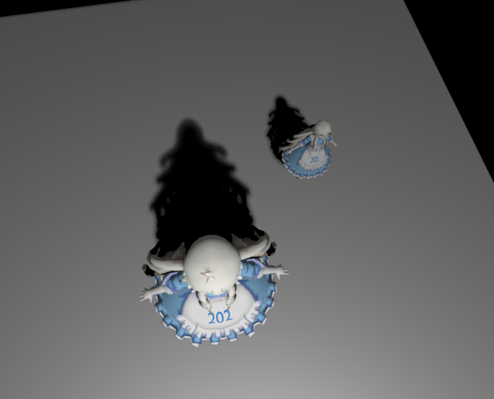
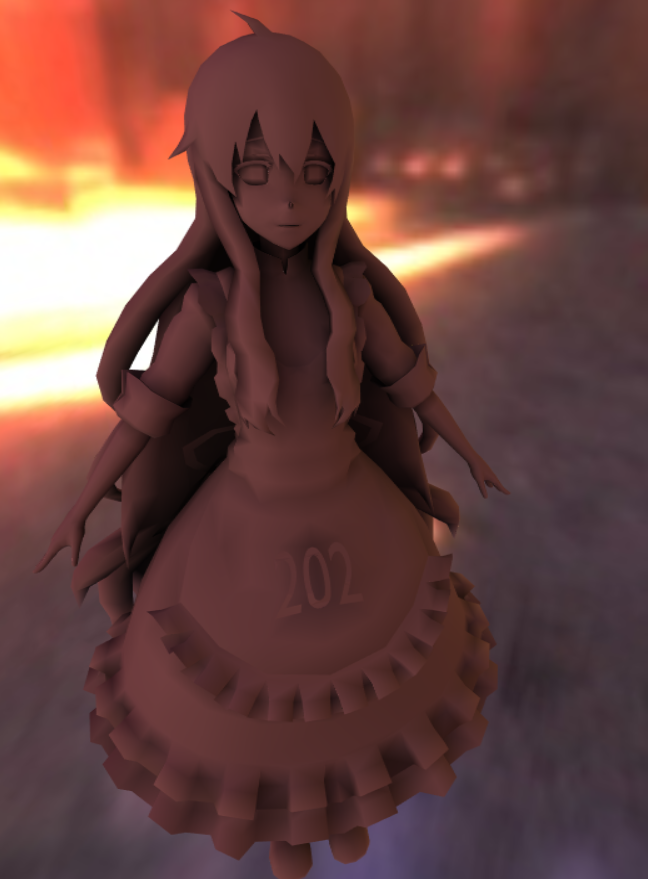
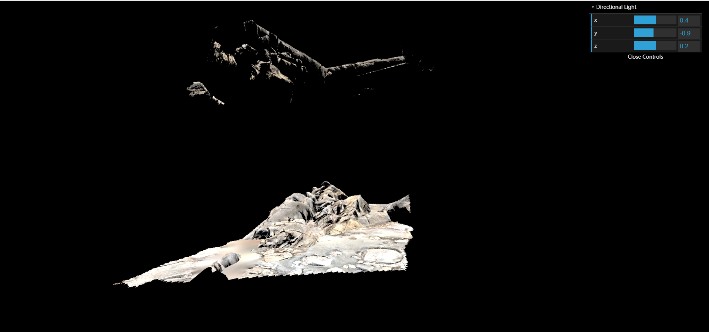
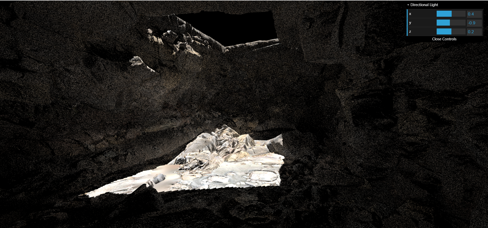
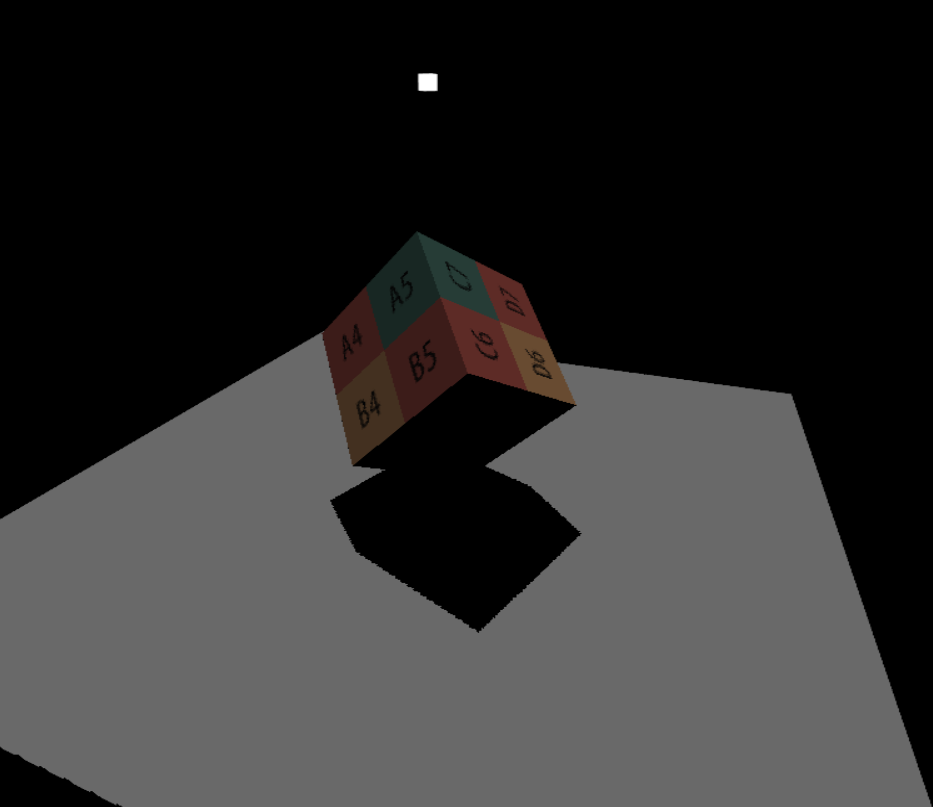
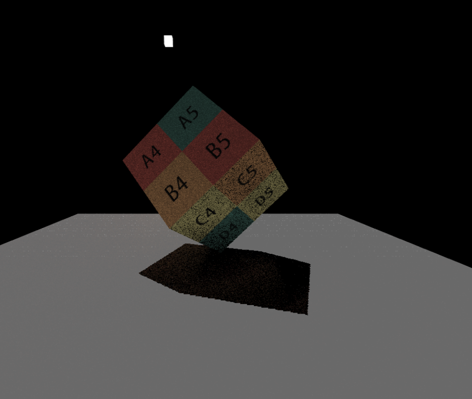
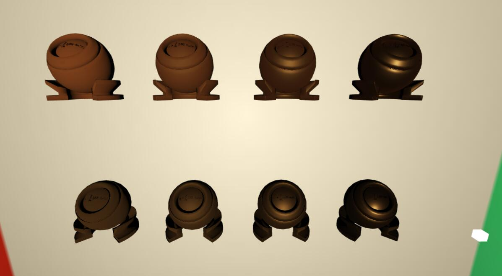

# Games202_hw_show
show Games202 hw pictures
 - 鉴于老师不让发源码，这里就发最终效果了
 - 作业一：Shadow Map,PCF,PCSS
 

 - 作业二：自反射，prt实现失败
 
 
 
  - 作业三：SSR对比
 
 
 
 

 
 - 作业四: PBR and KullaContyPBR
 
 
 
 - 作业五：实时光追降噪，À-Trous Wavelet加速
 
 